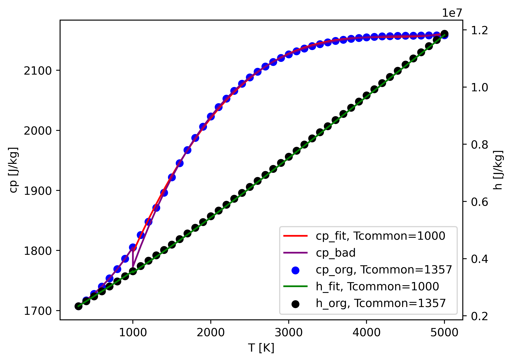

# fitData_cantera: fit thermo file to a uniform common T

As we know, OpenFOAM combines all species to a `mixture` by the [mass fraction weighted average](https://github.com/OpenFOAM/OpenFOAM-7/blob/master/src/thermophysicalModels/reactionThermo/mixtures/multiComponentMixture/multiComponentMixture.C#L130).
But for `thermo.dat`, we have `Tlow_` `Thigh_` `Tcommon_`.
During the average procedure, [`operator+=`](https://github.com/OpenFOAM/OpenFOAM-7/blob/master/src/thermophysicalModels/specie/thermo/janaf/janafThermoI.H#L268) is called.
You will find that the final `mixture_` will get the lowest `Tlow_`, highest `Thigh_`.
However, `Tcommon_` is never changed, which means `mixture_` will be that of the first species.
Usually, `Tcommon_` is 1000 K, but it's a different story for some species, such as 1400 K.
If you, unfortunately, list the species 1400 K as the first one, as I warned [here](https://github.com/ZhangYanTJU/chemicalMechanisms), you will face this problem after the Tmax of your CFD simulation reaches 1400 K:
```
Maximum number of iterations exceeded
```
It is because the Newton iterations failed when calculating temperature from enthalpy, and the discontinuous cp is the key to the problem.
And this exactly attributes to the wrong `Tcommon`.
The simplest but not perfect solution is to put the 1000 K species as the first one (in `chem.inp`, where OpenFOAM reads species list).
Also, you can use fitData utility in Chemkin, which can only fit one species at a time.

This script is developed to completely solve this problem.
Only need to run once this script, you'll get a fresh new thermo.dat, with a uniform Tcommon, which will give you continuous cp.

- install [Cantera](https://github.com/Cantera/cantera)

```shell
conda create --name spam --channel cantera cantera ipython matplotlib
```

- activate Cantera

```shell
conda activate spam
```

- transform your chemkin format mechanism to `*.cti` format

```shell
ck2cti --input=chem.inp --thermo=thermo.dat --output=mech.cti
```

- run the script

```shell
python fitData_Cantera.py
```

- you will get thermoCorrected.dat

Here is an example of the plotted figure.

For OH, we fit the Tcommon from 1357 to 1000 K.
`cp_org` is calculated by Cantera using the original mechanism file, which is set as the correct answer.
`cp_fit` is calculated using the newly fitted coeffs with new Tcommon.
And if you just manually change 1357 to 1000 in thermo.dat. You'll get the purple `cp_bad`, with a discontinuous cp.
However, this is not the worst condition! And your case may still run normally, but with little error introduced. 

If you mistakenly set a species with 'Tcommon = 1400 K' as the first species in 'chem.inp' (used in OpenFOAM), you will most likely get a wrong answer if the original Tcommon of N2 is 1000 K (here we assume N2 is the majority species).

